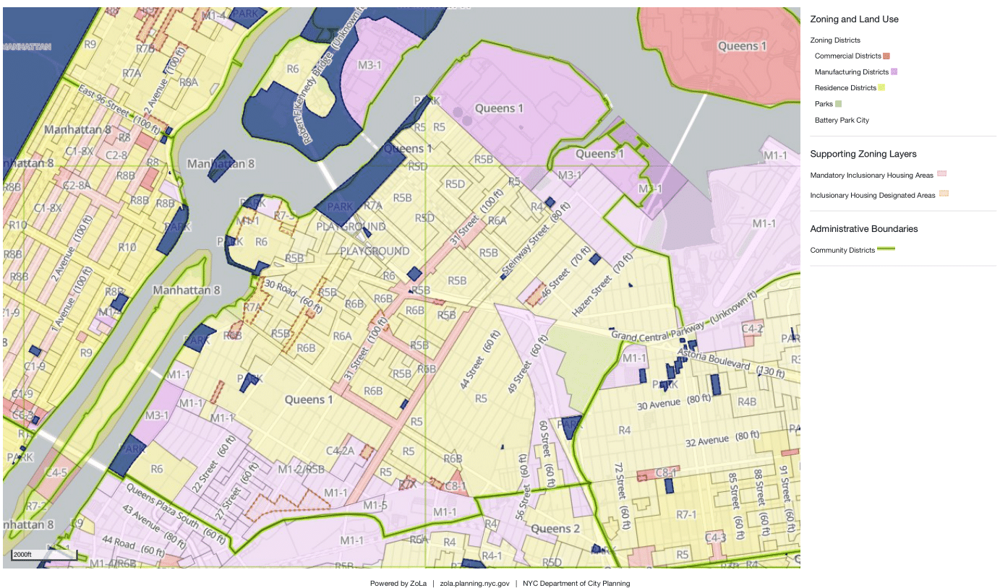

```{r setup, include=FALSE}
knitr::opts_chunk$set(echo = FALSE, warning = FALSE)
knitr::opts_chunk$set(out.width="556px", dpi=120)
library(readr)
library(tidyverse)
library(leaflet)
#library(mapview)
library(tigris)
library(sp)
library(rgeos)
library(rgdal)
library(viridis)
library(geojsonio)
library(reshape2)
library(colortools)
```

## Introduction
Astoria has seen a robust amount of redevelopment and new residents in the past few decades. The neighborhood's proximity to Manhattan,  waterfront, safety, relatively affordable housing, and diversity has played a big part in fueling growth and development in the area. Any potential rezoning of this important neighborhood, particularly in the context of new residential developments, will require a careful look at key metrics such as its' housing market and demographics to ensure that future developments effectively reflect the needs of the local community.

For the purposes of this report, Astoria will refer to both Queens Community District 1 and Census Bureau Public Use Microdata Area (PUMA) 4101 (which are roughly coterminous with one another).

## Zoning

First, we look at a contemporary map of Astoria zoning from the NYC Planning Department:



Most of Astoria is currently zoned for mid-rise residential development, ranging from 'R4' to 'R7' levels (a higher R number represents zoning for taller residential developments, with a lot of areas in Manhattan zoned for R10). However, the far north of Ditmars Steinway and the south end of Astoria are primarily zoned for manufacturing use.

As can be observed by the supporting zone layers, certain areas of Astoria are already zoned for either mandatory or inclusionary affordable housing. Any future residential rezoning of Astoria would certainly involve discussion of the merits of expanding such areas, and in what locations within the neighborhood.

## Construction Activity

For a better sense of how much construction activity has taken place in Astoria in recent years, we will refer to the Department of Housing Preservation and Development (HPD)'s **Housing New York Units by Building** dataset on buildings, units, and projects that began after January 1, 2014 and are counted towards the Housing New York plan.

```{r cons I, include = FALSE}
cons <- read_csv("Housing_New_York_Units_by_Building.csv")
astoria_cons <- cons[cons$'Community Board' == "QN-01",]
#head(astoria_cons,5)
```

According to this dataset, there have been 29 building projects that have taken place in Queens Community District 1 from 2014 to 2019. Of those, 18 were classified as new construction projects, while 11 were classified as preservation projects. 

```{r cons II}
table(astoria_cons$`Reporting Construction Type`)
```

```{r cons II-1, include = FALSE}
#Get shapefile of Census Bureau PUMAs for New York state
ny_pumas <- pumas(state = '36')
```

These building projects can be seen below. (Note that only 25 building projects are shown because some homeowner assistance projects do not have location information specified) . As can be seen on the map, there are clusters of construction activity in certain parts of Astoria. The waterfront near Hallets Point appears to be a popular spot for new residential developments, while the northwest of Ditmars-Steinway has had a cluster of buildings from the Marine Terrace Apartments project being constructed. There also appear to be some residential developments being built along areas of the 21st Street strip that have already been rezoned for inclusionary affordable housing.

```{r cons II-2}
#Convert data frame to spatial data frame to plot with leaflet
as_spdf <- astoria_cons[c(17,18)] 
as_spdf <- na.omit(as_spdf)
astoria_cons2 <- astoria_cons %>% drop_na(Longitude)
coordinates(as_spdf) <- ~Longitude + Latitude
proj4string(as_spdf) <- proj4string(ny_pumas)
matches <- over(as_spdf, ny_pumas)
astoria_cons2 <- cbind(astoria_cons2, matches)

leaflet(ny_pumas) %>%
   addTiles() %>% 
   addPolygons() %>% 
   addMarkers(~Longitude, ~Latitude, 
             popup = paste("Project Name:", astoria_cons2$'Project Name', "<br>",
                           "Project Start Date:", astoria_cons2$'Project Start Date', "<br>",
                           "Units:", astoria_cons2$'Total Units'),data=astoria_cons2)  %>%
   addProviderTiles("CartoDB.Positron") %>%
   setView(-73.914636,40.769658, zoom = 13)

#Gets a static shot of the map, for use in slides
#mapshot(leaf_con, file = paste0(getwd(), "/map.png"))
```

There were 1698 total units built in total from 2014 to 2019, with 1078 of them considered 'affordable, regulated units' counted towards the city's Housing New York Plan.
```{r cons III}
sum(astoria_cons$'Total Units')
sum(astoria_cons$`All Counted Units`)
```

Of the 1078 affordable units built from 2014 to 2019, 350 of them were considered extremely low income units (i.e. affordable to households earning 0 to 30% of the area's median income). Overall, The vast majority of these units were considered affordable to people from low to moderate income:

```{r cons IV}
#Getting counts and percentages of how many units were of each income level
astoria_long  <- astoria_cons[c(1,25:30)] 
astoria_long <- astoria_long %>% gather(income_level, value, -c('Project ID'))
df2 <- aggregate(value ~ factor(income_level, levels = c("Extremely Low Income Units", "Very Low Income Units", "Low Income Units", "Moderate Income Units", "Middle Income Units", "Other Income Units")), data = astoria_long, FUN = sum)
names(df2) <- c("income_level", "total")
df2$Pct <- round(df2$total / sum(df2$total),3)

afford <- ggplot(df2, aes(x=income_level, y=total)) + 
  geom_bar(stat = "identity") +
  geom_col(fill="steelblue") +
  geom_text(aes(label=total), vjust=-0.3, size=3.5) + theme(axis.text.x = element_text(angle = 45, vjust = 1, hjust=1)) +ggtitle("Affordable Units Built in Queens Community District 1 by Income Level, 2014-2019") +
  theme(plot.title = element_text(hjust = 0.5))
afford

```

Over half (595 out of 1078) of the affordable units constructed were 2-bedroom units. The rest were almost all studios or 1-bedroom units.

```{r cons V}
#Getting counts and percentages of how many units were of each bedroom size
astoria_long  <- astoria_cons[c(1,31:38)] 
astoria_long <- astoria_long %>% gather(bedroom_size, value, -c('Project ID'))
df2 <- aggregate(value ~ factor(bedroom_size, levels = c("Studio Units", "1-BR Units", "2-BR Units", "3-BR Units", "4-BR Units", "5-BR Units", "6-BR+ Units", "Unknown-BR Units")), data = astoria_long, FUN = sum)
names(df2) <- c("bedroom_size", "total")
df2$Pct <- round(df2$total / sum(df2$total),3)

bed_graph <- ggplot(df2, aes(x=bedroom_size, y=total)) + 
  geom_bar(stat = "identity") +
  geom_col(fill="steelblue") +
  geom_text(aes(label=total), vjust=-0.3, size=3.5) + theme(axis.text.x = element_text(angle = 45, vjust = 1, hjust=1)) +ggtitle("Affordable Units Built in Queens Community District 1 by Bedroom Size, 2014-2019") +
  theme(plot.title = element_text(hjust = 0.5))
bed_graph
```

Overall, a large share of the constructed units that counted towards the Housing New York plan appear to be affordable.

## Rent
According to data from the **Median Gross Rent by Bedrooms** report of the American Community Survey by the U.S. Census Bureau, the average rent of a 2-bedroom in the Astoria & Long Island City neighborhood was **$1,780** in 2018. This is on the higher end for neighborhoods in the Brooklyn and Queens boroughs.

Due to time constraints, all of the datasets from the Census Bureau were originally cleaned in Excel prior to importation into R.

```{r rent I, include = FALSE}
r18 <- read_csv("2018_rent.csv")
#Stripping out characters from the name of the PUMA so that I can isolate the data frame to just Queens and Brooklyn. Similar steps #will be taken many times in this code.

r18$puma <- gsub(" PUMA, New York.*$", "", r18$puma)
r18$puma <- gsub(" PUMA; New York.*$", "", r18$puma)
r18$puma <- gsub("NYC-", "", r18$puma)
r18$puma <- gsub(" Community District", " CD", r18$puma)
r18$borough <- sapply(strsplit(r18$puma," "), `[`, 1)

r18_filtered <- r18 %>% filter(
  borough == "Queens" | borough == "Brooklyn"
  )

```

```{r rent I-11}
rent_graph <- ggplot(r18_filtered, aes(x=reorder(puma,two_bed), y=two_bed)) + 
  geom_bar(stat = "identity") +
  geom_col(fill="steelblue") +
  geom_text(aes(label=two_bed), hjust=-0.1, size=3.5) +ggtitle("Average Rent of a 2-Bedroom in Brooklyn & Queens, 2018")  +coord_flip() +xlab("Neighborhood") +ylab("Rent")
rent_graph
```


```{r rent I-1, message = FALSE}
gg <- ggplot()

puma_codes <- read_csv("puma_codes.csv")
puma_codes <- puma_codes %>% 
  rename(
    puma = name,
    )
```

When we compare the rent in Astoria & Long Island City to all neighborhoods in NYC, we can see that the rent of a 2-bedroom in Astoria does not appear to be too high compared to the rest of the city. However, this is a byproduct of Manhattan rents being significantly higher than the rest of the city. As the table of the neighborhoods in New York City with the most expensive 2-bedroom rentals shows, while Astoria is still in the top 10 out of 55 neighborhoods in NYC, the 2-bedroom rental price of $1,780 is still only roughly 2/3 of the most expensive neighborhood of Greenwich Village and Soho at $2,711.


```{r rent II, include=FALSE}
#A geojson object of all of NYC's PUMAs taken from NYC Open Data
nyc_pumas <- geojson_read('C:\\Users\\NAMSON\\Desktop\\N.N.L\\data\\housing\\pumas.geojson', what="sp")
nyc_pumas_map <- fortify(nyc_pumas, region="puma")

#Making nyc_pumas a spatial data frame
mids <- cbind.data.frame(as.data.frame(gCentroid(nyc_pumas, byid=TRUE)), 
                         id=nyc_pumas$puma)

gc()

gg <- gg + geom_map(data=nyc_pumas_map, map=nyc_pumas_map,
                    aes(x=long, y=lat, map_id=id),
                    color="#2b2b2b", size=0.15, fill=NA)
```

```{r rent III, message = FALSE}
re18 <- read_csv("2018_rent.csv")
re18$puma <- gsub(", New York", "", re18$puma)
re18$puma <- gsub("; New York", "", re18$puma)

#Merging with puma_codes data frame so that the re18 data frame has a PUMA code in it. Useful for future merging tasks with other #data frames.
re18 <- re18  %>% left_join(puma_codes, by = "puma")
```

```{r rent IV}
gg <- gg + geom_map(data=re18, map=nyc_pumas_map,
                    aes(fill=two_bed, map_id=code),
                    color="#2b2b2b", size=0.15)
gg <- gg + scale_fill_viridis(name="Average Rent of a 2-Bedroom, 2018")
gg <- gg + coord_map()
gg <- gg + ggthemes::theme_map()
gg <- gg + theme(legend.position=c(0.1,0.7))
gg
```


```{r rent V}
re18 <- re18[order(re18$two_bed,decreasing=TRUE),] 
head(re18,10)
```

## Tax Expenditures

New York City uses a form of tax abatement and other foregone tax revenue in order to induce developers to create and/or preserve affordable housing units. NYC HPD has published a dataset of tax incentives that have been provided for Local Law 44 Housing Development Projects since 2013. These tax incentives are defined as the **estimated dollar amount for Year 1 of associated tax exemption**. By comparing the level of tax incentives in Astoria to other neighborhoods in Queens and Brooklyn, we can observe how much the city has been investing in newly constructed housing in Astoria relative to other neighborhoods nearby:

```{r tax I, include = FALSE}
#Importing tax incentive dataset, and merging with buildings dataset to get locations of the buildings that received tax incentives to be constructed
tax <- read_csv("Local_Law_44_-_Tax_Incentive.csv")
buildings <- read_csv("Local_Law_44_-_Building.csv")
tax2 <- tax %>% left_join(buildings, by = "ProjectID")

tax_spdf <- tax2[c(24,25)] 

#Many buildings do not have location information and need to be dropped from this study
tax_spdf <- na.omit(tax_spdf)
tax3 <- tax2 %>% drop_na(Longitude)
coordinates(tax_spdf) <- ~Longitude + Latitude
proj4string(tax_spdf) <- proj4string(ny_pumas)
matches <- over(tax_spdf, ny_pumas)
tax3 <- cbind(tax3, matches)
```

However, a complicating factor in trying to assess the level of tax expenditure by neighborhood is that some projects that received tax incentives constructed buildings in multiple boroughs and/or neighborhoods. This was resolved by finding the projects that funded buildings in multiple neighborhoods and dividing the tax expenditure spent equally amongst all the buildings in the project. For example, if a tax expenditure was $1,000,000 for a project where 3 buildings were constructed in Astoria and 2 in Bushwick, then $600,000 of the tax expenditure was deemed to have been invested in Astoria, while $400,000 was deemed to have been invested in Bushwick.

```{r tax II}
#Getting a count of how many buildings there are by project, then dividing the total tax incentive for each project by the number of buildings in it
test2 <- tax3  %>% count(ProjectID)
tax3 <- tax3 %>% left_join(test2, by = "ProjectID")
tax3$adj_tax = tax3$TaxIncentiveDWID/tax3$n

#Dropping Manhattan, the Bronx, and Staten Island from the dataset
tax4 <- tax3 %>% filter(
  Borough == "3" | Borough == "4"
  )

tax5 <- tax4 %>% group_by(NAMELSAD10) %>% summarise(x = sum(adj_tax))
tax5$x <- round(tax5$x,2)

tax5$dist <- sapply(strsplit(tax5$NAMELSAD10, "--"), "[", 2)
tax5$dist <- gsub(" PUMA.*$", "", tax5$dist)
tax5 <- tax5 %>% rename(tax_expenditures = x) 

taxplot <- ggplot(tax5, aes(x=reorder(dist,tax_expenditures), y=tax_expenditures)) + 
  geom_bar(stat = "identity") +
  geom_col(fill="steelblue") +
  geom_text(aes(label=tax_expenditures), hjust=-0.1, size=3.5) +ggtitle("Tax Expenditures by Community District in BK & QNS Since 2013")  +coord_flip() +xlab("Community District")
taxplot

```

As we can see, approximately $4,844 in tax expenditures have been spent in Astoria since 2013. This  appears to be a relatively low amount in comparison to the surrounding neighborhoods of Brooklyn and Queens - almost 10 times more tax expenditures have been put forth in Bedford-Stuyvesant and Jamaica. While there are many possible reasons for this discrepancy, the data does suggest that relatively few tax incentives have been spent constructing affordable housing in Astoria.


## Demographic Trends

The American Community Survey by the Census Bureau also reports annual race and ethnicity data, which we can use to look at demographic trends over time in Astoria.

While Astoria underwent drastic changes to its' racial  composition from 2000 to 2010, its' racial composition has remained relatively stable in this last decade. There may be a possible downward trend in the Hispanic population, but it not an entirely obvious or consistent decline over the decade. The white, African-American, and Asian populations have remained relatively stable.

```{r dem I, include = FALSE}
puma_codes <- puma_codes %>% 
  rename(
    cd = puma,
    )

#The Census Bureau provides a separate csv for each year, so once downloaded from http://www.data.census.gov, they all need to be cleaned and merged together first
race_2010 <- read_csv("race_2010.csv")
race_2010$code <- gsub("PUMA 0", "", race_2010$`puma`)
race_2010$code <- gsub(", New York", "", race_2010$code)
race_2010$year <- 2010
race_2010$code <- as.numeric(race_2010$code)
race_2010 <- race_2010  %>% left_join(puma_codes, by = "code")
race_2010$`puma` <- NULL

race_2011 <- read_csv("race_2011.csv")
race_2011$code <- gsub("PUMA 0", "", race_2011$`puma`)
race_2011$code <- gsub(", New York", "", race_2011$code)
race_2011$year <- 2011
race_2011$code <- as.numeric(race_2011$code)
race_2011 <- race_2011  %>% left_join(puma_codes, by = "code")
race_2011$`puma` <- NULL

race_2012 <- read_csv("race_2012.csv")
race_2012$year <- 2012
race_2013 <- read_csv("race_2013.csv")
race_2013$year <- 2013
race_2014 <- read_csv("race_2014.csv")
race_2014$year <- 2014
race_2015 <- read_csv("race_2015.csv")
race_2015$year <- 2015
race_2016 <- read_csv("race_2016.csv")
race_2016$year <- 2016
race_2017 <- read_csv("race_2017.csv")
race_2017$year <- 2017
race_2018 <- read_csv("race_2018.csv")
race_2018$year <- 2018

race_12_18 <- rbind(race_2012,race_2013,race_2014,race_2015,race_2016,race_2017,race_2018)

race_12_18$`puma` <- gsub(", New York", "", race_12_18$`puma`)
race_12_18$`cd` <- gsub("; New York", "", race_12_18$`puma`)

race_12_18 <- race_12_18  %>% left_join(puma_codes, by = "cd")
race_12_18$puma <- NULL
race <- rbind(race_12_18,race_2010,race_2011)
race <- race %>% drop_na(total)
race <- race %>% drop_na(cd)
race$total <- as.numeric(race$total)
race$white <- as.numeric(race$white)
race$african_american <- as.numeric(race$african_american)
race$asian <- as.numeric(race$asian)
race$hispanic <- as.numeric(race$hispanic)

race$white_pct <- round(race$white / race$total, 3)
race$african_american_pct <- round(race$african_american / race$total, 3)
race$asian_pct <- round(race$asian / race$total, 3)
race$hispanic_pct <- round(race$hispanic / race$total, 3)

race$cd <- gsub(" PUMA, New York.*$", "", race$cd)
race$cd <- gsub(" PUMA; New York.*$", "", race$cd)
race$cd <- gsub("NYC-", "", race$cd)
race$cd <- gsub(" Community District", " CD", race$cd)
race$cd <- gsub(" PUMA", "", race$cd)
race$borough <- sapply(strsplit(race$cd," "), `[`, 1)

race_filtered <- race %>% filter(
  borough == "Queens" | borough == "Brooklyn"
  )

astoria <- race_filtered[race_filtered$code == "4101", ]

#Converting data from wide to long format, making it easier to plot
ast_long <- melt(astoria,
        # ID variables - all the variables to keep but not split apart on
    id.vars=c("cd", "year"),
        # The source columns
    measure.vars=c("white_pct", "hispanic_pct", "african_american_pct", "asian_pct" ),
        # Name of the destination column that will identify the original
        # column that the measurement came from
    variable.name="variable",
    value.name="percent"
)


```

```{r dem II-1, include = FALSE}
ggplot(ast_long, aes(x = year, y = percent, group = variable)) +
	geom_line(aes(colour = variable), size=3) +
	theme_classic() + ggtitle("Racial Composition of Astoria + Long Island City PUMA in the 2010s") +
  theme(plot.title = element_text(hjust = 0.5)) + theme_minimal() +
    scale_color_discrete(name = "Racial % of Population")
```

As can be seen in the plots below, Astoria experienced a relatively minor increase in the percentage of white persons as a share of the population from 2011 to 2018; other neighborhoods such as Bushwick and Bedford-Stuyvesant in Brooklyn experienced a much larger increase, while some neighborhoods such as Ridgewood and Bayside experienced a significant decline in the white population as a share of the overall population.

```{r dem III}
long <- melt(race_filtered,
        # ID variables - all the variables to keep but not split apart on
    id.vars=c("cd", "year"),
        # The source columns
     measure.vars=c("white_pct", "hispanic_pct", "african_american_pct", "asian_pct" ),
        # Name of the destination column that will identify the original
        # column that the measurement came from
    variable.name="variable",
    value.name="percent")

long <- long %>% drop_na(percent)

#We want to focus only on changes to the white percent of each neighborhood for this visualization
long_white <- long %>% filter(
  variable == "white_pct" 
  )

long_white <- long_white %>% filter(
  year == "2011" | year == "2018"
  )
long_white$year <- as.character(long_white$year)
long_white$cd <- fct_reorder(long_white$cd, long_white$percent, min)

#A second wide data frame is needed for this particular plot
data_wide <- dcast(long, cd + variable ~ year, value.var="percent")

data_wide_white <- data_wide %>% filter(
  variable == "white_pct" 
  )

data_wide_white <- data_wide_white %>% 
  rename(
    pct_2011 = '2011',
    )

data_wide_white <- data_wide_white %>% 
  rename(
    pct_2018 = '2018',
    )

data_wide_white$cd <- fct_reorder(data_wide_white$cd, data_wide_white$pct_2011, min)
data_wide_white <- data_wide_white %>% drop_na(pct_2011)
data_wide_white <- data_wide_white %>% drop_na(pct_2018)
keeps <- c("cd", "pct_2011","pct_2018")
data_wide_white <- data_wide_white[keeps]

p3 = ggplot() +
     geom_point(data=long_white, aes(y=cd, x=percent, color=year)) +
     geom_segment(data=data_wide_white, aes(y=cd, yend=cd, x=`pct_2011`, xend=`pct_2018`)) +ggtitle("Whites as % of Population, 2011 to 2018")
p3
```

Similarly, the African-American population of Astoria remained relatively stable at around 8-9% of the population over time while other neighborhoods showed larger changes, most notably Bedford-Stuyvesant in Brooklyn. 

Note that Bedford-Stuyvesant received the amount of largest tax expenditures from the city on newly constructed housing, yet has seen the most pronounced increase in the white population and decrease in African-American population of all neighborhoods in Broolyn and Queens. It is unclear why this is the case, although Bedford-Stuyvesant has had a reputation for being a gentrifying neighborhood in recent years.

```{r dem IV}
#Doing the same process as in the previous plot, except replacing white wth african_american

long_black <- long %>% filter(
  variable ==  "african_american_pct" 
  )

long_black <- long_black %>% filter(
  year == "2011" | year == "2018"
  )
long_black$year <- as.character(long_black$year)
long_black$cd <- fct_reorder(long_black$cd, long_black$percent, min)

data_wide_black <- data_wide %>% filter(
  variable == "african_american_pct" 
  )

data_wide_black <- data_wide_black %>% 
  rename(
    pct_2011 = '2011',
    )

data_wide_black <- data_wide_black %>% 
  rename(
    pct_2018 = '2018',
    )

data_wide_black <- data_wide_black %>% drop_na(pct_2011)
data_wide_black <- data_wide_black %>% drop_na(pct_2018)
data_wide_black <- data_wide_black[keeps]

p4 = ggplot() +
     geom_point(data=long_black, aes(y=cd, x=percent, color=year)) +
     geom_segment(data=data_wide_black, aes(y=cd, yend=cd, x=`pct_2011`, xend=`pct_2018`)) +ggtitle("African-Americans as % of Population, 2011 to 2018")
p4

```

However, in relative changes the Hispanic population of Astoria, comparatively speaking does show a relatively large decline. Bushwick in Brooklyn again stands out as a neighborhood with an increase in the white population and decrease in minority populations.

```{r dem V}
#This time with the Hispanic population.

long_h <- long %>% filter(
  variable ==  "hispanic_pct" 
  )

long_h <- long_h %>% filter(
  year == "2011" | year == "2018"
  )
long_h$year <- as.character(long_h$year)
long_h$cd <- fct_reorder(long_h$cd, long_h$percent, min)

data_wide_h <- data_wide %>% filter(
  variable == "hispanic_pct" 
  )

data_wide_h <- data_wide_h %>% 
  rename(
    pct_2011 = '2011',
    )

data_wide_h <- data_wide_h %>% 
  rename(
    pct_2018 = '2018',
    )

data_wide_h <- data_wide_h %>% drop_na(pct_2011)
data_wide_h <- data_wide_h %>% drop_na(pct_2018)
data_wide_h <- data_wide_h[keeps]

p5 = ggplot() +
     geom_point(data=long_h, aes(y=cd, x=percent, color=year)) +
     geom_segment(data=data_wide_h, aes(y=cd, yend=cd, x=`pct_2011`, xend=`pct_2018`)) +ggtitle("Hispanics as % of Population, 2011 to 2018")
p5

```

Overall, it does not appear that drastic changes to Astoria's racial composition have occurred in the last 10 years, especially in juxtaposition with many other neighborhoods that have seen more pronounced racial changes, such as Bushwick and Bedford/Stuyvesant in Brooklyn.

## Affordability and Occupancy

A key metric of housing affordability is the percentage of a renter's monthly income that goes to rent; anything above 33% is often seen as overly impacted. The American Community Survey collects annual data on the percentage of a renter's income that goes to paying rent, which enables us to study how financially impacted Astoria residents are compared to the rest of New York City.

In 2018, 36.4% of renters in Astoria's neighborhood had to **pay over 35% of rent**, which was on the lower end in New York City. Neighborhoods in Manhattan generally could more easily afford to pay for their housing, while neighborhoods such as Flushing in Queens and Borough Park in Brooklyn (the two yellow neighborhoods on the map) had 59.3% and 60.4% of their renters respectively having over 35% of their monthly income going to rent.

```{r aac 0, include = FALSE}
aff_2018 <- read_csv("aff_2018.csv")
```


```{r aac I}
aff_2018 <- aff_2018 %>% 
  rename(
    cd = 'Geographic Area Name',
    )

aff_2018$cd<- gsub(", New York", "", aff_2018$cd)
aff_2018$cd <- gsub("; New York", "", aff_2018$cd)
aff_2018<- aff_2018  %>% left_join(puma_codes, by = "cd")
aff_2018$cd <- gsub(" PUMA.*$", "", aff_2018$cd )
aff_2018$cd  <- gsub(" PUMA.*$", "", aff_2018$cd )
aff_2018$cd  <- gsub("NYC-", "", aff_2018$cd )
aff_2018$cd <- gsub(" Community District", " CD", aff_2018$cd )
aff_2018$borough <- sapply(strsplit(aff_2018$cd," "), `[`, 1)

gg2 <- ggplot()

#A geojson of NYC PUMAs is plotted first, then the plot of affordability data is plotted over it
gg2 <- gg2 + geom_map(data=nyc_pumas_map, map=nyc_pumas_map,
                    aes(x=long, y=lat, map_id=id),
                    color="#2b2b2b", size=0.15, fill=NA)
gg2 <- gg2 + geom_map(data=aff_2018, map=nyc_pumas_map,
                    aes(fill=aff_2018$`35_or_more`, map_id=code),
                    color="#2b2b2b", size=0.15)
gg2 <- gg2 + scale_fill_viridis(option="inferno", name = "% Paying >35% of Income in Rent, 2018")
gg2 <- gg2 + coord_map()
gg2 <- gg2 + ggthemes::theme_map()
gg2 <- gg2 + theme(legend.position=c(0,0.7))
gg2


```

As this table of the monthly rent burden of Queens neighborhoods indicates, Astoria has residents who are more able to afford their rents compared to other neighborhoods in Queens. 11.8% of Astoria residents use less than 15% of their income for rent, while 36.4% use 35% or more of their income for rent.

```{r aac II}
as_aff <- aff_2018 %>% filter(
  borough == "Queens" 
  )

as_aff[order(as_aff$'35_or_more',decreasing=TRUE),] 
```

Finally, we look at some occupancy statistics for renters in Astoria, which also come from the U.S. Census Bureau. First off is a map of the percentage of **bedrooms occupied by only 1 person** in 2018, which shows some interesting trends. Astoria is on the higher end for bedrooms occupied by one person, ranking 14th out of 55 PUMAs at 37.6%. Relatively speaking, Astoria residents are able to enjoy more private bedrooms than most of the rest of New York City.

```{r aac III-0, include = FALSE}
occ_2018 <- read_csv("occ_2018.csv")
```

```{r aac III}
occ_2018 <- occ_2018 %>% 
  rename(
    cd = 'Geographic Area Name',
    )

occ_2018$cd<- gsub(", New York", "", occ_2018$cd)
occ_2018$cd <- gsub("; New York", "", occ_2018$cd)
occ_2018<- occ_2018  %>% left_join(puma_codes, by = "cd")
occ_2018$cd <- gsub(" PUMA.*$", "", occ_2018$cd )
occ_2018$cd  <- gsub(" PUMA.*$", "", occ_2018$cd )
occ_2018$cd  <- gsub("NYC-", "", occ_2018$cd )
occ_2018$cd <- gsub(" Community District", " CD", occ_2018$cd )
occ_2018$borough <- sapply(strsplit(occ_2018$cd," "), `[`, 1)

gg3 <- ggplot()
gg3 <- gg3 + geom_map(data=nyc_pumas_map, map=nyc_pumas_map,
                    aes(x=long, y=lat, map_id=id),
                    color="#2b2b2b", size=0.15, fill=NA)
gg3 <- gg3 + geom_map(data=occ_2018, map=nyc_pumas_map,
                    aes(fill=occ_2018$`one_person`, map_id=code),
                    color="#2b2b2b", size=0.15)
gg3 <- gg3 + scale_fill_viridis(option="plasma", name = "% of 1-Person Occupied Bedrooms, 2018")
gg3 <- gg3 + coord_map()
gg3 <- gg3 + ggthemes::theme_map()
gg3 <- gg3 + theme(legend.position=c(0,0.7))
gg3
```

We also look at the percentage of **renters who are living as part of a family household** in 2018. Astoria has the 8th lowest percentage out of 55 NYC neighborhoods of families at 43.5%. Outside of Manhattan, Astoria and Brooklyn Heights in Brooklyn are the two neighborhoods in NYC with the lowest percentage of renters who are living with family. Assuming that young adults are the least likely to be living with family, this is a good indication that Astoria is a neighborhood that has a disproportionately high number of residents who are single and unmarried.

```{r aac IV}
gg4 <- ggplot()
gg4 <- gg4 + geom_map(data=nyc_pumas_map, map=nyc_pumas_map,
                    aes(x=long, y=lat, map_id=id),
                    color="#2b2b2b", size=0.15, fill=NA)
gg4 <- gg4 + geom_map(data=occ_2018, map=nyc_pumas_map,
                    aes(fill=occ_2018$`family_household`, map_id=code),
                    color="#2b2b2b", size=0.15)
gg4 <- gg4 + scale_fill_viridis(option="cividis", name = "% of Renter Family Households, 2018")
gg4 <- gg4 + coord_map()
gg4 <- gg4 + ggthemes::theme_map()
gg4 <- gg4 + theme(legend.position=c(0,0.7))
gg4
```

Overall the affordability and occupancy data shows that Astoria is doing well as a neighborhood, at least compared to many of its neighbors in Queens. However, while Astoria may be affordable to most of its current residents, it is out of reach for many other New Yorkers who cannot afford the high rents of the area. Any discussion with the local Community Board about the need for rezoning in the area should point out how much these maps show Astoria as thriving compared to other neighborhoods in Queens, and that these conditions show that there is significant merit to the idea of allieviating these housing inequities through rezoning policy, and/or the construction of new residential developments in Astoria.

## Conclusion

Overall Astoria appears to be a fairly stable neighborhood in terms of its demographics and housing market conditions. While rent is fairly high for a non-Manhattan neighborhood, Astoria renters on average do not dedicate as much of their income to rent as other neighborhoods. In addition, the racial composition of the neighborhood has remained relatively stable on time. 

Since this report has primarily focused on descriptive and exploratory analysis, the evidence should be reliable given the credibility of Census Bureau and NYC data. That being said, there were some limitations to the analysis due to time constraints - there are many important demographics beyond ethnicity to consider, for example. 

The success of any potential new residential developments that may result from rezoning is contingent on where exactly these developments take place. There have already been many projects built near Hallets Point, the north of Ditmar-Steinsway, and along the affordable housing corridor on 21st Street. Rezoning areas for new residential developments near those already robust housing construction areas is a strategy that should prove effective.

Finally, there already appears to be an abundance of new housing projects in Astoria since 2014 despite the relative dearth of tax incentives provided by the city so far to those developments. This indicates that the housing market in Astoria is already robust, which is sensible given many of the attractive characteristics of the Astoria neighborhood. This being so, the City should more aggressively **rezone parts of Astoria for residential development** and **use tax incentives to mandate inclusionary housing** in the area, as this can improve housing equity by providing more low-income citizens the opportunity to live in Astoria. 